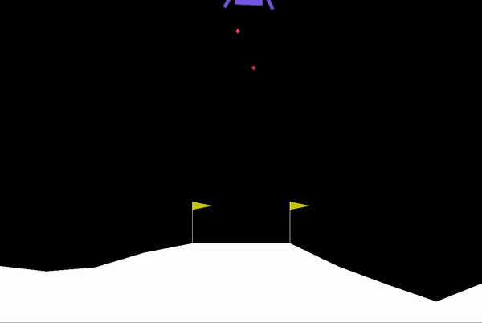

# PPO Distillation for LunarLander-v3

A minimal pipeline to  
1. Train a full-size PPO “teacher” on `LunarLander-v3`  
2. Distill that teacher into smaller “student” policies via action-mimic reward  
3. Evaluate and compare performance at different network sizes  
4. Plot training curves and generate test-run GIFs

Training Bloopers!

---

## 📋 Prerequisites

- Python ≥ 3.8  
- `pip install gymnasium[box2d] stable-baselines3[extra] pandas matplotlib imageio`

---

## 📁 Directory Structure
├── distill_lunar_lander.py # train teacher, student, make GIF

├── distill_with_plots.py # train + Monitor logs + plot curves

├── evaluate_models.py # evaluate models and tabulate results

├── results/

│ └── all gifs + results csvs

├── videos/

└── logs/

└── models  # note we haven't uploaded these but comment out the functions to generate these in main to run your own!

   └── ppo_teacher_v3.pt
   
   └── ppo_student_v3_64_8.pt
   
   └── etc ...
   
   
